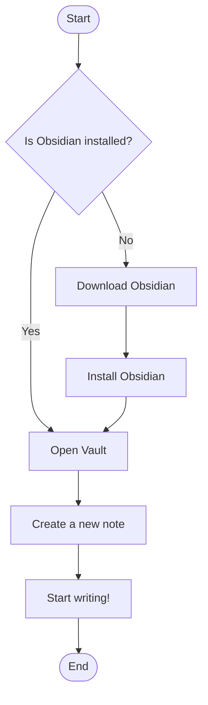
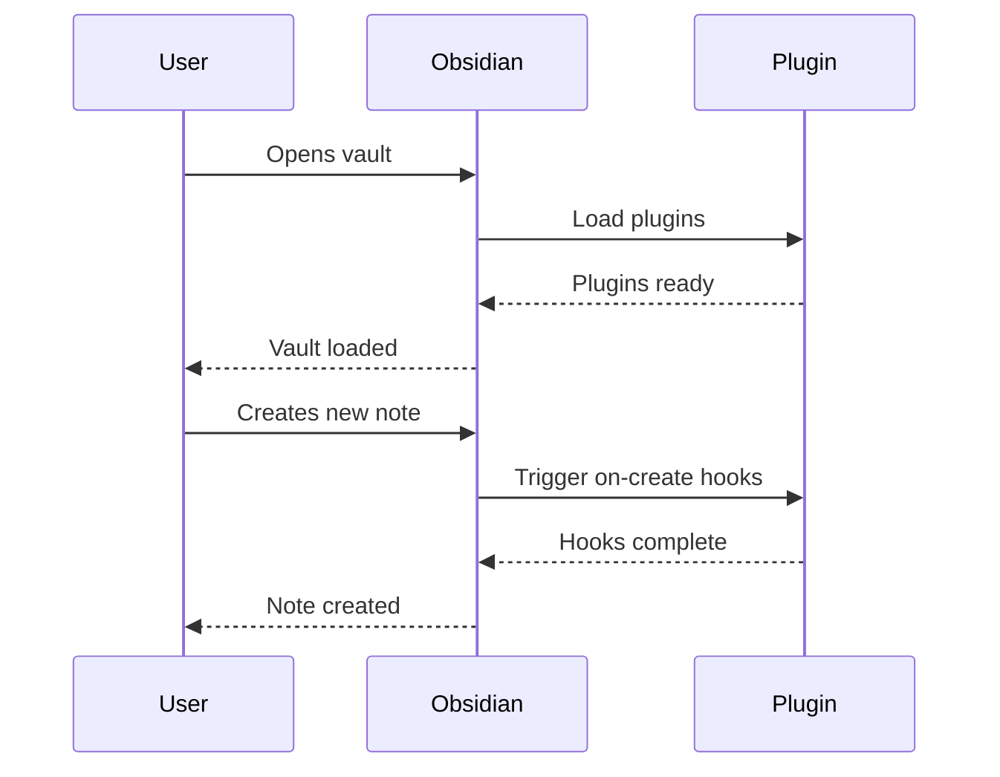
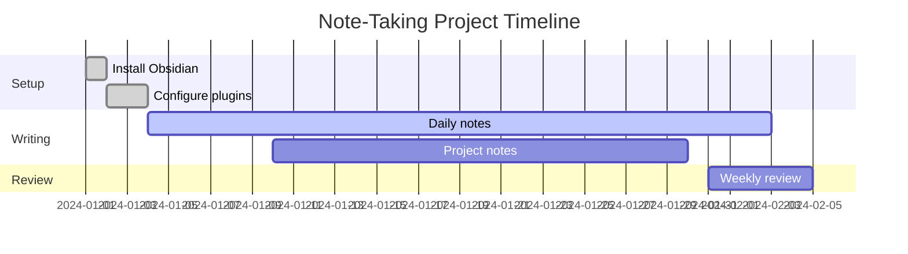
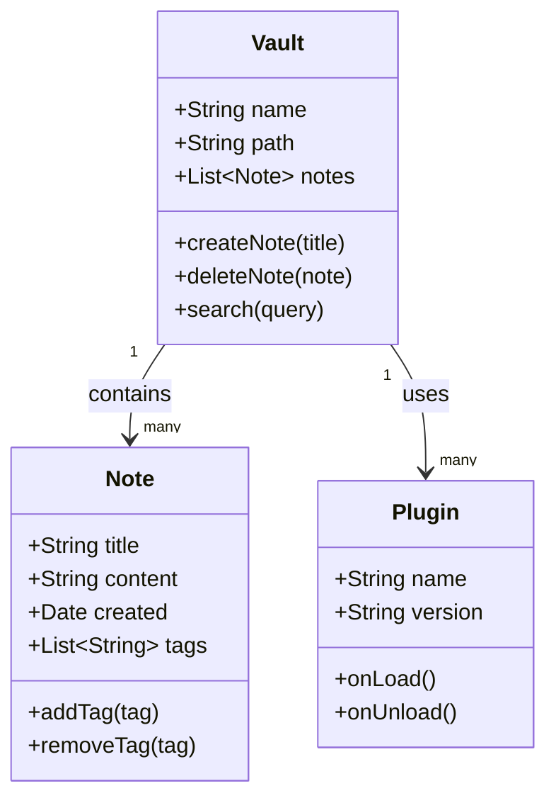
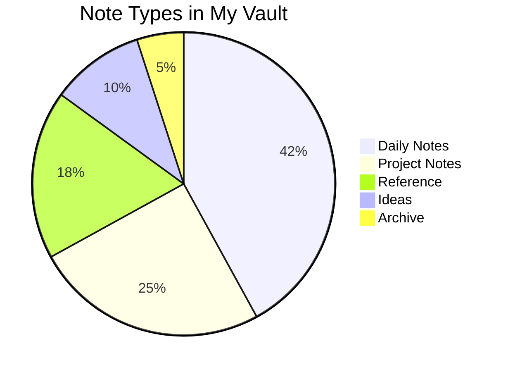

																																																																																																																																																																																									
# 🧪 Obsidian Syntax Test File

> [!NOTE]
> This file tests **all major Obsidian syntax features**. Open it in Obsidian and verify each section renders correctly.

---

## 📑 Table of Contents

- [[#Headings]]
- [[#Text Formatting]]
- [[#Lists]]
- [[#Tasks]]
- [[#Links & Embeds]]
- [[#Tables]]
- [[#Code]]
- [[#Callouts]]
- [[#Math]]
- [[#Footnotes]]
- [[#Tags & Metadata]]
- [[#Mermaid Diagrams]]
- [[#HTML]]

---

## Headings

# Heading 1
## Heading 2
### Heading 3
#### Heading 4
##### Heading 5
###### Heading 6

---

## Text Formatting

**Bold text** and __also bold__

*Italic text* and _also italic_

***Bold and italic*** and ___also bold italic___

~~Strikethrough text~~

==Highlighted text==

=={red}Highlighted text==

`Inline code`

This is a regular paragraph with a line break.
Use two spaces at end of line or a blank line for new paragraphs.

> This is a blockquote.
> It can span multiple lines.

> Nested blockquote level 1
>> Nested blockquote level 2
>>> Nested blockquote level 3

---

## Lists

### Unordered Lists

- Item one
- Item two
  - Nested item A
  - Nested item B
    - Deeply nested item
- Item three

* Asterisk list item
* Another asterisk item

+ Plus list item
+ Another plus item

### Ordered Lists

1. First item
2. Second item
   1. Nested ordered item
   2. Another nested item
3. Third item

### Mixed Lists

1. Ordered item one
   - Unordered nested
   - Another unordered nested
2. Ordered item two
   - More nesting
     1. Back to ordered

---

## Tasks

- [ ] Uncompleted task
- [x] Completed task
- [ ] Another pending task
  - [ ] Nested subtask
  - [x] Completed subtask
- [x] All done!

---

## Links & Embeds

### External Links

[Obsidian website](https://obsidian.md)

[Link with title](https://obsidian.md "Obsidian - A second brain")

Raw URL: https://obsidian.md

### Internal (Wiki) Links

[[Some Note]]

[[Some Note|Custom display text]]

[[Some Note#A Heading|Link to heading with alias]]

### Block References

[[Some Note#^block-id]]

### Images


![[50-504125_1920x1080-periodic-table-wallpaper-photos-for-mobile-periodic.jpg|546|372x269]]
# Section Heading

test embeddd


| País | PBI |
| ---- | --- |
| ARG  | 100 |
| BRA  | 200 |
^tabla-1
```emic-charts-view
#-----------------#
#- chart type    -#
#-----------------#
type: Bar

#-----------------#
#- chart data    -#
#-----------------#
data: mdtable:^tabla-1

#-----------------#
#- chart options -#
#-----------------#
options:
  xField: País
  yField: PBI
```

### Embeds

![[Some Other Note]]

![[Some Other Note#Section Heading]]

---

## Tables

| Column A | Column B | Column C |
|----------|----------|----------|
| Cell 1   | Cell 2   | Cell 3   |
| Cell 4   | Cell 5   | Cell 6   |
^tabla-3

### Aligned Columns

| Left aligned | Center aligned | Right aligned |
|:-------------|:--------------:|--------------:|
| Apple        |     Banana     |        Cherry |
| Dog          |      Cat       |         Bird  |
| 100          |      200       |           300 |
^tabla-2

### Complex Table

| Feature        | Obsidian | Notion | Roam |
|----------------|:--------:|:------:|:----:|
| Local storage  | ✅        | ❌      | ❌    |
| Graph view     | ✅        | ❌      | ✅    |
| Plugin system  | ✅        | ✅      | ❌    |
| Free tier      | ✅        | ✅      | ❌    |
| Markdown       | ✅        | ⚠️      | ⚠️   |
^tabla-1

---

## Code

### Inline Code

Use `console.log()` to print to the JavaScript console.

Run `pip install obsidian` in your terminal.

### Fenced Code Blocks

```python
def fibonacci(n: int) -> list[int]:
    """Return the first n Fibonacci numbers."""
    sequence = [0, 1]
    for i in range(2, n):
        sequence.append(sequence[i-1] + sequence[i-2])
    return sequence[:n]

print(fibonacci(10))
```

```javascript
// Async fetch with error handling
async function fetchData(url) {
  try {
    const response = await fetch(url);
    if (!response.ok) throw new Error(`HTTP error: ${response.status}`);
    const data = await response.json();
    return data;
  } catch (error) {
    console.error("Fetch failed:", error);
  }
}
```

```bash
# Shell commands
echo "Hello, Obsidian!"
ls -la ~/Documents/Obsidian
grep -r "TODO" ./notes --include="*.md"
```

```sql
SELECT
  notes.title,
  COUNT(links.id) AS backlink_count,
  notes.created_at
FROM notes
LEFT JOIN links ON notes.id = links.target_id
GROUP BY notes.id
ORDER BY backlink_count DESC
LIMIT 10;
```

```json
{
  "vault": "My Vault",
  "plugins": ["dataview", "templater", "kanban"],
  "theme": "Minimal",
  "settings": {
    "spellcheck": true,
    "lineWidth": 700,
    "fontSize": 16
  }
}
```

---

## Callouts

> [!NOTE]
> This is a **note** callout. Useful for supplementary information.

> [!TIP]
> This is a **tip** callout. Great for helpful suggestions.

> [!IMPORTANT]
> This is an **important** callout. Use for critical information.

> [!WARNING]
> This is a **warning** callout. Use to signal potential issues.

> [!DANGER]
> This is a **danger** callout. Use for serious warnings.

> [!ABSTRACT]
> This is an **abstract** or summary callout.

> [!INFO]
> This is an **info** callout with extra detail.

> [!SUCCESS]
> This is a **success** callout. Task completed!

> [!QUESTION]
> This is a **question** callout. Something to think about?

> [!QUOTE]
> "The mind is not a vessel to be filled but a fire to be kindled."
> — Plutarch

> [!BUG]
> This is a **bug** callout. Found an issue!


> [!EXAMPLE]
> This is an **example** callout with a demonstration.

### Foldable Callouts

> [!FAQ]- Click to expand this FAQ
> This callout is **collapsed by default**. Click the arrow to expand it.

> [!NOTE]+ This callout is expanded by default
> The `+` keeps it open. The `-` collapses it. No symbol = always open.

### Nested Callout

> [!INFO] Outer callout
> Some outer content.
> > [!WARNING] Inner callout
> > Nested warning inside the info block.

---

## Math

### Inline Math

The quadratic formula is $x = \frac{-b \pm \sqrt{b^2 - 4ac}}{2a}$  that gets printed.

Euler's identity: $e^{i\pi} + 1 = 0$  shows something interesting

### Block Math

$$
\int_{-\infty}^{\infty} e^{-x^2} \, dx = \sqrt{\pi}
$$

$$
\begin{pmatrix}
a & b \\
c & d
\end{pmatrix}
\begin{pmatrix}
e & f \\
g & h
\end{pmatrix}
=
\begin{pmatrix}
ae+bg & af+bh \\
ce+dg & cf+dh
\end{pmatrix}
$$

$$
\sum_{n=1}^{\infty} \frac{1}{n^2} = \frac{\pi^2}{6}
$$

---

## Footnotes

Here is a sentence with a footnote.[^1]

Another sentence with a longer footnote.[^longnote]

Inline footnote^[This footnote is defined right here inline, without a separate reference.]

[^1]: This is the first footnote.

[^longnote]: This footnote has multiple lines.
    Indent the continuation with 4 spaces.
    You can include **formatting** here too.

---

## Tags & Metadata

### Inline Tags

This note is about #obsidian and #markdown syntax testing. It also covers #productivity/notes and #tools/writing.

### YAML Frontmatter

*(The following block demonstrates frontmatter — in a real note it would be at the very top of the file)*

```yaml
---
title: Obsidian Syntax Test
aliases:
  - Syntax Reference
  - Markdown Cheatsheet
tags:
  - obsidian
  - markdown
  - reference
  - testing
created: 2024-01-15
modified: 2024-06-01
status: complete
priority: high
---
```

---

## Mermaid Diagrams

### Flowchart



### Sequence Diagram



### Gantt Chart



### Class Diagram



### Pie Chart



---

## HTML

<details>
<summary>Click to expand HTML details block</summary>

This content is hidden inside a `<details>` tag.  
You can use **Markdown** inside here too.

- Item one
- Item two

</details>

<br>

<mark>This text is highlighted using HTML mark tag.</mark>

<kbd>Ctrl</kbd> + <kbd>Shift</kbd> + <kbd>P</kbd> opens the command palette.

<sup>Superscript text</sup> and <sub>subscript text</sub>

---

## Horizontal Rules

Three ways to make a horizontal rule:

---

***

___

---

## Special Characters & Escaping

Escaped asterisk: \*not italic\*

Escaped brackets: \[\[not a wikilink\]\]

Escaped hashtag: \#not-a-tag

Unicode: 🚀 ⭐ 📝 🔗 💡 🎯 ✅ ❌ ⚠️ 🔒

Em dash — and en dash –

Ellipsis…

---

*End of syntax test file. If everything above renders correctly, your Obsidian setup is working perfectly!* 🎉
